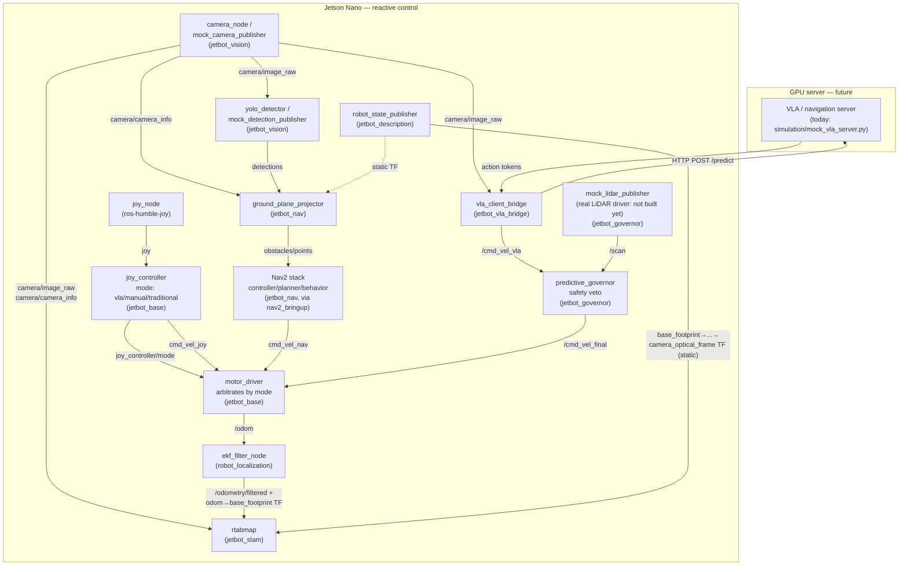

# JetBot VLA-ROS2

A Waveshare JetBot (Jetson Nano 4GB) driven by natural-language instructions: a client-server architecture where the Jetson handles reactive/safety control and a separate GPU machine runs the high-level "brain" (a VLA/navigation model). See [`brain_research_report.md`](brain_research_report.md) for the research behind that choice, and [`action_plan.md`](action_plan.md) for the overall project phases.

**Status**: the ROS2 graph below is fully built and verified end-to-end against mocks (no VLA server, no LiDAR, no camera required to test the wiring). The Jetson Nano itself has not been flashed/configured yet, and no real hardware (LiDAR, calibrated camera) has been connected. Isaac Sim simulation is planned but blocked on hardware (see [`isaac_sim_setup.md`](isaac_sim_setup.md)).

## How the nodes communicate



Notes on the diagram:
- **No mux node.** `motor_driver` subscribes to all three candidate sources (`cmd_vel_joy`, `cmd_vel_final`, `cmd_vel_nav`) directly and follows whichever `joy_controller/mode` currently selects — this replaced an earlier `twist_mux` + `mode_arbiter` combination. See `jetbot_base`'s README for the two distinct fail-safe rules this implements (selected source stale → stop; **mode signal itself stale → stop unconditionally**, since losing the joystick means losing the human's override channel regardless of which autonomous mode was active).
- **`jetbot_slam`** does visual localization/loop-closure only (monocular camera, no depth) — not an obstacle-aware map for Nav2. Nav2's costmaps instead consume `ground_plane_projector`'s camera-derived obstacle points directly. See `jetbot_slam`'s and `jetbot_nav`'s READMEs for why.

## Repo layout

```
.
├── ros_ws/src/
│   ├── jetbot_base/         motor control + arbitration, odometry, joystick input, master bringup launch
│   ├── jetbot_vision/       camera capture, mock camera, YOLO detector
│   ├── jetbot_governor/     LiDAR safety veto ("the WAM layer"), mock LiDAR
│   ├── jetbot_vla_bridge/   VLA server client
│   ├── jetbot_nav/          Nav2 + camera-fed costmap (traditional pipeline)
│   ├── jetbot_slam/         RTAB-Map monocular SLAM launch/config
│   └── jetbot_description/  URDF + RViz visualization
├── simulation/
│   ├── mock_vla_server.py   FastAPI stand-in for a real VLA server
│   └── sim_test_suite.md    3 documented safety test scenarios (see "Testing" below)
├── action_plan.md           project phases
├── research_report.md       original ROS2/VLA architecture research
├── brain_research_report.md VLA/LLM/World-Model options research (Gemma, OpenVLA, ViNT, Cosmos, ...)
├── isaac_sim_setup.md       Isaac Sim setup notes (blocked on hardware — see below)
└── launch_guide.md          original topic/launch planning notes
```

Each package under `ros_ws/src/` has its own `README.md` with node-level detail (topics, parameters, known gaps) — this file covers the whole-system picture.

## Prerequisites

- Ubuntu 22.04 (Jammy) + ROS2 Humble. (If you're setting up a *second* machine as a GPU server — e.g. for the VLA/navigation model — Ubuntu 20.04 works too, since that side doesn't need to run this ROS2 graph directly; see `brain_research_report.md`'s hardware notes.)
- Python: use the system `/usr/bin/python3` (3.10), not a conda/pyenv Python that may be earlier in `PATH` — `rclpy`'s compiled extension is built against the system interpreter and fails with `ModuleNotFoundError: No module named 'rclpy._rclpy_pybind11'` under a mismatched Python.

## Installation

```bash
# Base ROS2 Humble install, if not already present
sudo apt update
sudo apt install ros-humble-desktop python3-colcon-common-extensions

# This project's extra dependencies (not part of ros-humble-desktop)
sudo apt install -y \
  ros-humble-joy \
  ros-humble-rtabmap-ros \
  ros-humble-camera-info-manager-py \
  ros-humble-nav2-bringup \
  ros-humble-vision-msgs \
  ros-humble-robot-localization

# Clone and build
git clone https://github.com/DeveshwarH1996/jetbot_VLA_ROS_Humble.git
cd jetbot_VLA_ROS_Humble/ros_ws
source /opt/ros/humble/setup.bash
colcon build --symlink-install
source install/setup.bash
```

Python dependencies for the (non-ROS) mock VLA server: `pip install fastapi uvicorn python-multipart`.

## Getting started (mock mode, no hardware required)

This runs the entire graph against synthetic sensors — useful for verifying wiring changes without a robot in hand.

**1. Start the mock VLA server** (separate terminal, plain Python — not a ROS2 node):
```bash
cd simulation
python3 mock_vla_server.py
```

**2. Launch the main pipeline:**
```bash
source /opt/ros/humble/setup.bash
source ros_ws/install/setup.bash
ros2 launch jetbot_base bringup.launch.py mock_mode:=true server_url:=http://localhost:8000/predict
```
This starts `joy_node`, `joy_controller`, `motor_driver` (mock motors), `predictive_governor`, `vla_client_bridge`, `mock_camera_publisher`, and `mock_lidar_publisher` together. `joy_node` needs a real joystick and will log errors without one — that's expected if you don't have one plugged in.

**3. (Optional) Drive manually** — cycle `joy_controller`'s mode to `'manual'` with your controller's mapped button (default: Xbox Start/Menu, see `jetbot_base`'s README), then use the left stick. Without a physical controller, publish synthetic `sensor_msgs/Joy` messages instead:
```bash
ros2 topic pub /joy sensor_msgs/msg/Joy "{axes: [0.0, 0.8, 0,0,0,0,0,0], buttons: [0,0,0,0,0,0,0,1,0,0,0]}" -r 20
```
The joystick always overrides whichever autonomous mode is active, and losing the `/joy` feed entirely (controller unplugged) stops the robot outright, regardless of mode — see `jetbot_base`'s README for why.

**4. (Optional) Visualize the robot in RViz:**
```bash
ros2 launch jetbot_description display.launch.py
```

**5. (Optional) Run SLAM** — needs `robot_state_publisher` (step 4) and the bringup pipeline (step 2) already running for their TF/camera/odom topics:
```bash
ros2 launch jetbot_slam slam.launch.py
```

**6. (Optional) Simulate an obstacle** and watch `predictive_governor` veto forward motion:
```bash
ros2 param set /mock_lidar_publisher front_distance 0.2
```

**7. (Optional) Run the traditional (Nav2) pipeline** — needs `robot_state_publisher` (step 4) and the bringup pipeline (step 2) already running:
```bash
ros2 launch jetbot_nav nav.launch.py mock_mode:=true
```
This starts a synthetic detection (no `ultralytics`/camera needed), projects it onto the ground plane as a costmap obstacle, and brings up the full Nav2 stack. Cycle `joy_controller`'s mode to `'traditional'` (two button presses from the default `'vla'`) to actually drive using it.

## Testing

```bash
cd ros_ws
colcon test --packages-select jetbot_governor jetbot_base jetbot_vision jetbot_vla_bridge jetbot_nav
```

`jetbot_governor`'s `test_predictive_governor.py` is the one package with real behavioral unit tests (front-arc distance logic, edge cases). The rest of the suite is ROS2's standard `ament_flake8`/`ament_pep257`/`ament_copyright` lint boilerplate — there's a known backlog of docstring-style lint findings across most files (pre-existing, not functional bugs); not yet cleaned up.

`simulation/sim_test_suite.md` documents 3 scenario-level tests (Wall/Override/Latency) that were manually verified against a live launch during development — not yet automated as `launch_testing`.

## Known gaps / what's not done

- **No real LiDAR driver package** — `mock_lidar_publisher` only, still feeding `predictive_governor`. Deliberately out of scope for now: `jetbot_nav`'s costmap runs off the camera (`ground_plane_projector`) as the primary obstacle source, with real LiDAR planned as separate future integration work once the hardware is on the robot.
- **Jetson Nano not yet flashed/configured** — everything above has only been run on a dev workstation against mocks.
- **No wheel encoders** on the Waveshare kit — `/odom` is open-loop dead-reckoning only (see `jetbot_base`'s README), fused through `robot_localization` but not made accurate by it.
- **`jetbot_nav`'s ground-plane obstacle projection** only sees objects touching the floor in view, and is meaningfully less accurate than real depth/LiDAR — a legitimate bridge technique, not a permanent substitute (see `jetbot_nav`'s README).
- **No static map / AMCL** — Nav2 runs costmap-only (rolling window off live camera obstacles), since `jetbot_slam`'s monocular RTAB-Map doesn't produce an occupancy grid. Add `map_server`/`amcl` once a real occupancy-grid source exists.
- **No real VLA/navigation model deployed** — only the random-token mock server. `brain_research_report.md`'s recommendation is to start with ViNT/NoMaD (navigation-specific), not a manipulation-focused VLA like OpenVLA.
- **`yolo_detector`** needs `ultralytics` + an exported TensorRT engine (neither ships in-repo) to run for real; `mock_detection_publisher` covers testing the rest of the pipeline without either.
- **Physical robot constants (`wheel_base`, `max_linear_vel`, `max_angular_vel`, `footprint`) are consolidated into `jetbot_base/config/robot_params.yaml`** and shared by `motor_driver`, `joy_controller`, and (merged in at launch time) `jetbot_nav`'s Nav2 config — but the URDF still isn't auto-derived from it, so the two can still drift if only one gets updated. This already happened once (`wheel_base` disagreed with the URDF's actual wheel spacing by 37%, caught while doing this consolidation) — see `jetbot_description`'s README.
- **`joy_controller`'s button/axis indices are not verified against physical hardware** — no Xbox controller available in this dev environment. Defaults come from `teleop_twist_joy`'s own reference config; confirm with `ros2 topic echo /joy` before trusting them.
- **`predictive_governor`'s veto is still a fixed LiDAR-distance threshold**, not the "intelligent decision between traditional and VLA" direction described for the governor long-term — see `brain_research_report.md`.
- **No LICENSE file** at the repo root (individual packages declare MIT internally).
- Isaac Sim: blocked on GPU hardware (needs an RTX-class GPU; see `isaac_sim_setup.md` and the GPU server hardware notes in `brain_research_report.md`), and `simulate_jetbot.py`'s ROS2 bridge wiring is still a non-functional stub.
