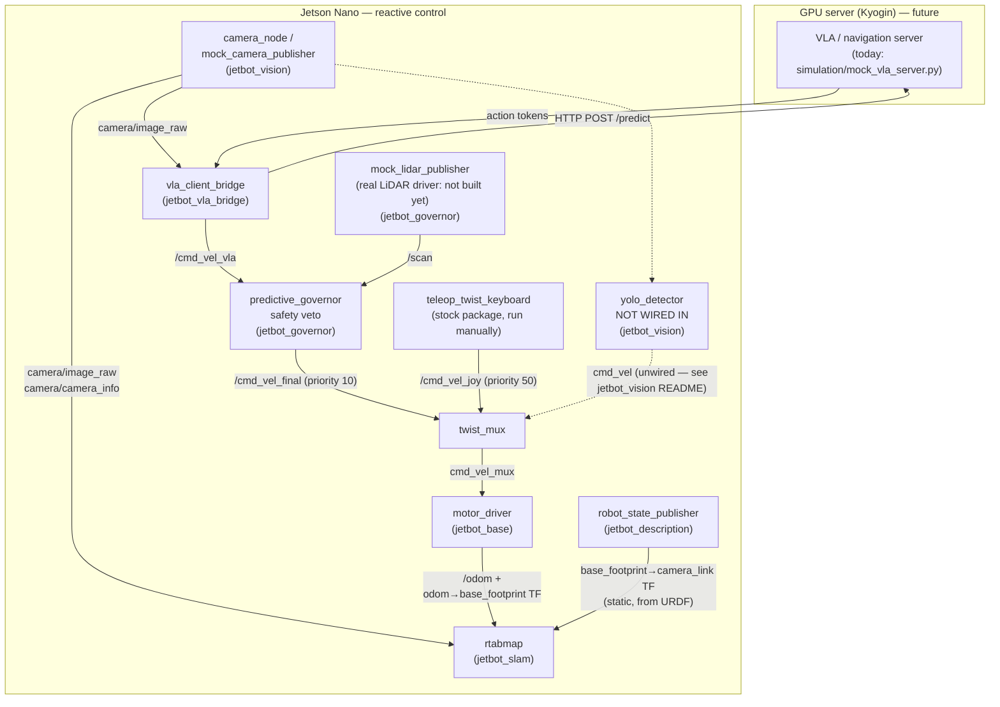

# JetBot VLA-ROS2

A Waveshare JetBot (Jetson Nano 4GB) driven by natural-language instructions: a client-server architecture where the Jetson handles reactive/safety control and a separate GPU machine runs the high-level "brain" (a VLA/navigation model). See [`brain_research_report.md`](brain_research_report.md) for the research behind that choice, and [`action_plan.md`](action_plan.md) for the overall project phases.

**Status**: the ROS2 graph below is fully built and verified end-to-end against mocks (no VLA server, no LiDAR, no camera required to test the wiring). The Jetson Nano itself has not been flashed/configured yet, and no real hardware (LiDAR, calibrated camera) has been connected. Isaac Sim simulation is planned but blocked on hardware (see [`isaac_sim_setup.md`](isaac_sim_setup.md)).

## How the nodes communicate



Notes on the diagram:
- **`twist_mux` priority** (higher number wins): `cmd_vel_safety` (90, reserved — nothing publishes here yet) > `cmd_vel_joy` (50) > `cmd_vel_final` (10, the VLA path). See `ros_ws/src/jetbot_base/config/twist_mux.yaml`.
- **`yolo_detector`** publishes to plain `cmd_vel`, which isn't a `twist_mux` input — it's dead code today, shown dashed above. See `jetbot_vision`'s README before relying on it.
- **`jetbot_slam`** does visual localization/loop-closure only (monocular camera, no depth) — not an obstacle-aware map for Nav2. See `jetbot_slam`'s README for why.

## Repo layout

```
.
├── ros_ws/src/
│   ├── jetbot_base/         motor control, odometry, teleop, twist_mux config, master bringup launch
│   ├── jetbot_vision/       camera capture, mock camera, YOLO detector
│   ├── jetbot_governor/     LiDAR safety veto ("the WAM layer"), mock LiDAR
│   ├── jetbot_vla_bridge/   VLA server client
│   ├── jetbot_slam/         RTAB-Map monocular SLAM launch/config
│   └── jetbot_description/  URDF + RViz visualization
├── simulation/
│   ├── mock_vla_server.py   FastAPI stand-in for a real VLA server
│   └── sim_test_suite.md    3 documented safety test scenarios (see "Testing" below)
├── action_plan.md           project phases
├── research_report.md       original ROS2/VLA architecture research
├── brain_research_report.md VLA/LLM/World-Model options research (Gemma, OpenVLA, ViNT, Cosmos, ...)
├── isaac_sim_setup.md       Isaac Sim setup notes (blocked on hardware — see below)
└── launch_guide.md          original topic/launch planning notes
```

Each package under `ros_ws/src/` has its own `README.md` with node-level detail (topics, parameters, known gaps) — this file covers the whole-system picture.

## Prerequisites

- Ubuntu 22.04 (Jammy) + ROS2 Humble. (If you're setting up a *second* machine as a GPU server — e.g. for the VLA/navigation model — Ubuntu 20.04 works too, since that side doesn't need to run this ROS2 graph directly; see `brain_research_report.md`'s hardware notes.)
- Python: use the system `/usr/bin/python3` (3.10), not a conda/pyenv Python that may be earlier in `PATH` — `rclpy`'s compiled extension is built against the system interpreter and fails with `ModuleNotFoundError: No module named 'rclpy._rclpy_pybind11'` under a mismatched Python.

## Installation

```bash
# Base ROS2 Humble install, if not already present
sudo apt update
sudo apt install ros-humble-desktop python3-colcon-common-extensions

# This project's extra dependencies (not part of ros-humble-desktop)
sudo apt install -y \
  ros-humble-twist-mux \
  ros-humble-rtabmap-ros \
  ros-humble-camera-info-manager-py

# Clone and build
git clone https://github.com/DeveshwarH1996/jetbot_VLA_ROS_Humble.git
cd jetbot_VLA_ROS_Humble/ros_ws
source /opt/ros/humble/setup.bash
colcon build --symlink-install
source install/setup.bash
```

Python dependencies for the (non-ROS) mock VLA server: `pip install fastapi uvicorn python-multipart`.

## Getting started (mock mode, no hardware required)

This runs the entire graph against synthetic sensors — useful for verifying wiring changes without a robot in hand.

**1. Start the mock VLA server** (separate terminal, plain Python — not a ROS2 node):
```bash
cd simulation
python3 mock_vla_server.py
```

**2. Launch the main pipeline:**
```bash
source /opt/ros/humble/setup.bash
source ros_ws/install/setup.bash
ros2 launch jetbot_base bringup.launch.py mock_mode:=true server_url:=http://localhost:8000/predict
```
This starts `motor_driver` (mock motors), `twist_mux`, `predictive_governor`, `vla_client_bridge`, `mock_camera_publisher`, and `mock_lidar_publisher` together.

**3. (Optional) Drive manually and confirm it overrides the VLA:**
```bash
ros2 run teleop_twist_keyboard teleop_twist_keyboard --ros-args -r cmd_vel:=cmd_vel_joy
```

**4. (Optional) Visualize the robot in RViz:**
```bash
ros2 launch jetbot_description display.launch.py
```

**5. (Optional) Run SLAM** — needs `robot_state_publisher` (step 4) and the bringup pipeline (step 2) already running for their TF/camera/odom topics:
```bash
ros2 launch jetbot_slam slam.launch.py
```

**6. (Optional) Simulate an obstacle** and watch `predictive_governor` veto forward motion:
```bash
ros2 param set /mock_lidar_publisher front_distance 0.2
```

## Testing

```bash
cd ros_ws
colcon test --packages-select jetbot_governor jetbot_base jetbot_vision jetbot_vla_bridge
```

`jetbot_governor`'s `test_predictive_governor.py` is the one package with real behavioral unit tests (front-arc distance logic, edge cases). The rest of the suite is ROS2's standard `ament_flake8`/`ament_pep257`/`ament_copyright` lint boilerplate — there's a known backlog of docstring-style lint findings across most files (pre-existing, not functional bugs); not yet cleaned up.

`simulation/sim_test_suite.md` documents 3 scenario-level tests (Wall/Override/Latency) that were manually verified against a live launch during development — not yet automated as `launch_testing`.

## Known gaps / what's not done

- **No real LiDAR driver package** — `mock_lidar_publisher` only. This blocks any real Nav2 costmap (needs a real obstacle source).
- **Jetson Nano not yet flashed/configured** — everything above has only been run on a dev workstation against mocks.
- **No wheel encoders** on the Waveshare kit — `/odom` is open-loop dead-reckoning only (see `jetbot_base`'s README).
- **No Nav2 configuration** — the Nav2 packages are installed (pulled in as `rtabmap-ros` dependencies) but nothing in this repo configures them yet.
- **No real VLA/navigation model deployed** — only the random-token mock server. `brain_research_report.md`'s recommendation is to start with ViNT/NoMaD (navigation-specific), not a manipulation-focused VLA like OpenVLA.
- **`yolo_detector`** needs `ultralytics` + an exported TensorRT engine (neither ships in-repo), and isn't wired into `twist_mux` even when it does run.
- **No LICENSE file** at the repo root (individual packages declare MIT internally).
- Isaac Sim: blocked on GPU hardware (needs an RTX-class GPU; see `isaac_sim_setup.md` and the Kyogin hardware notes in `brain_research_report.md`), and `simulate_jetbot.py`'s ROS2 bridge wiring is still a non-functional stub.
